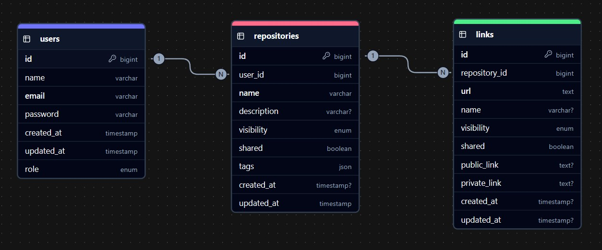

# Documentación de API - Linktri - Adrián Dader

## Introducción
Esta API está construida con **Laravel 11** y sigue prácticas modernas de desarrollo, incluyendo autenticación basada en tokens, validación estricta de datos y respuestas estandarizadas en formato JSON.

## Configuración del entorno Laravel 11
```bash
composer install

// requiere generar un .env y una key:
cp .env.example .env
php artisan key:generate

composer require laravel/sanctum


//levantar servidor
php artisan serve
```
## Diagrama ER


## **Ruta**s públicas - Autenticación

### Registro de usuario
- **Método** ```post```
- **Ruta** ```http://localhost:xxxx/api/register```
- **Descripción:** Datos necesarios para registrar usuarios (role → user).
- **Tokens necesarios:** NO
- **Body Json:** 
```json
{
  "name": "Nombre Usuario",
  "email": "usuario@example.com",
  "password": "password",
  "password_confirmation": "password"
}
```
- Respuesta esperada:
```json
{
  "message": "Usuario creado correctamente.",
  "user": {
    "name": "UserName",
    "email": "example@example.com",
    "role": "user",
    "updated_at": "yyyy-mm-ddThh:hh:hh.hhhhhh",
    "created_at": "yyyy-mm-ddThh:hh:hh.hhhhhh",
    "id": 20
  },
  "api_access_login": "http://localhost:xxxx/api/login",
  "payload_example_login": {
    "email": "example@example.com",
    "password": "1234"
  },
  "access_token": "32|KtEBMr9SrvC...", //* Guardar token en HTTP Headers para hacer login
  "token_type": "Bearer"
}
```

### Login

- **Método** ```post```
- **Ruta** ```http://localhost:xxxx/api/login```
- **Descripción:** Iniciar sesión y obtener token de autenticación.
- **Tokens necesarios:** NO
- **Body Json:** 
```json
{
  "email": "usuario@example.com",
  "password": "password"
}
```
- Respuesta esperada:
```json
{
  "message": "Usuario UserName logeado correctamente.",
  "api_access": "http://localhost:xxxx/api/repository",
  "payload_example": {
    "name": "",
    "description": "",
    "visibility": "private | public",
    "shared": "true | false",
    "tags": [
      "Tag1",
      "Tag2",
      "..."
    ]
  },
  "access_token": "29|ULOBahNGRaL...", //* Guardar token en HTTP Headers para hacer login
  "token_type": "Bearer"
}
```

## **Ruta**s privadas

### Repositorios

- [Información de Tags:](#tags)

- **Método** ```get```
- **Ruta** ```http://localhost:xxxx/api/repository```
- **Descripción:** Obtener todos los repositorios del usuario autenticado.
- **Tokens necesarios:** SI
    - HTTP Headers
        - Accept application/json
        - Authorization Bearer [tu token...]

- Respuesta esperada:
```json
{
    //* Cantidad de repositorios creados.
    //* Al principio se parte con 0 repositorios
  []
}
```

- **Método** ```post```
- **Ruta** ```http://localhost:xxxx/api/repository```
- **Descripción:** Crear repositorios.
- **Tokens necesarios:** SI
    - HTTP Headers
        - Accept application/json
        - Authorization Bearer [tu token...]
- **Body Json:** 
```json
{
    "name": "Mi primer repositorio",
    "description": "Este es un repositorio de prueba",
    "visibility": "public",
    "shared": true,
    "tags": ["Arte"] // Deben crearse tags que están reflejadas en la documentación.
}
```

- Respuesta esperada:
```json
[
  {
    "id": 0,
    "user_id": 0,
    "name": "Mi primer repositorio",
    "description": "Este es un repositorio de prueba",
    "visibility": "public",
    "shared": true,
    "tags": [
      "Arte"
    ],
    "created_at": "yyyy-mm-ddThh:hh:hh.hhhhhhh",
    "created_at": "yyyy-mm-ddThh:hh:hh.hhhhhhh",
  }
]
```


- **Método** ```put```
- **Ruta** ```http://localhost:xxxx/api/repository/{id}```
- **Descripción:** Actualizar repositorios.
- **Tokens necesarios:** SI
    - HTTP Headers
        - Accept application/json
        - Authorization Bearer [tu token...]
- **Body Json:** 
```json
{
    
    "name": "Modificacion de nombre del reposaitorio con ID 7",
    "description": "Este es un repositorio de prueba",
    "visibility": "public",
    "shared": true,
    "tags": ["Arte"]  // Deben crearse tags que están reflejadas en la documentación.


}
```

- Respuesta esperada:
```json
{
  "message": "Repositorio actualizado correctamente."
}
```

- **Método** ```delete```
- **Ruta** ```http://localhost:xxxx/api/repository/{id}```
- **Descripción:** Eliminar repositorios.
- **Tokens necesarios:** SI
    - HTTP Headers
        - Accept application/json
        - Authorization Bearer [tu token...]

- Respuesta esperada:
```json
{
  "message": "Repositorio eliminado"
}
```

### Enlaces


- **Método** ```get```
- **Ruta** ```http://localhost:xxxx/api/{repository_id}/enlaces```
- **Descripción:** Obtener todos los enlaces del repositorio del usuario autenticado.
- **Tokens necesarios:** SI
    - HTTP Headers
        - Accept application/json
        - Authorization Bearer [tu token...]

- Respuesta esperada:
```json
{
    //* Cantidad de repositorios creados.
    //* Al principio se parte con 0 enlaces
  []
}
```

- **Método** ```post```
- **Ruta** ```http://localhost:xxxx/api/{repository_id}/enlaces```
- **Descripción:** Crear enlaces en el repositorio.
- **Tokens necesarios:** SI
    - HTTP Headers
        - Accept application/json
        - Authorization Bearer [tu token...]
- **Body Json:** 
```json
{
  "url": "https://www.example.com",
  "name": "nombre o alias del enlace en cuestión",
  "visibility": "public",
  "shared": false
}
```

- Respuesta esperada:
```json
{
  "message": "Enlace creado correctamente.",

  "id": 10,
  "repository_id": 10,
  "url": "https://www.put_exampleusuario31.com",
  "name": "Enlace a ejemplo usando OooooUT",
  "visibility": "private",
  "shared": true,
  "public_link": "https://example.com/xxxxxxxxx",
  "private_link": "https://example.com/private/xxxxxxxxxxx",
  "created_at": "yyyy-mm-ddThh:hh:hh.hhhhhhh",
  "created_at": "yyyy-mm-ddThh:hh:hh.hhhhhhh",
}


```


- ****Método**** ```put```
- **Ruta** ```http://localhost:xxxx/api/{repository_id}/enlaces/{enlace_id}```
- **Descripción:** Actualizar enlace seleccionado por id.
- **Tokens necesarios:** SI
    - HTTP Headers
        - Accept application/json
        - Authorization Bearer [tu token...]
- **Body Json:** 
```json
{
  "url": "https://www.newexample.com",
  "name": "nuevo nombre o alias del enlace en cuestión",
  "visibility": "private",
  "shared": true
}
```

- Respuesta esperada:
```json
{
  "message": "Enlace actualizado correctamente."
}
```

- ****Método**** ```delete```
- **Ruta** ```http://localhost:xxxx/api/{repository_id}/enlaces/{enlace_id}```
- **Descripción:** Eliminar enlace seleccionado.
- **Tokens necesarios:** SI
    - HTTP Headers
        - Accept application/json
        - Authorization Bearer [tu token...]

- Respuesta esperada:
```json
{
  "message": "Enlace eliminado"
}
```

<a name="tags"></a>
### Listado de tags 

```json
[
  "Matemáticas", "Física", "Química", "Biología", "Geografía",
  "Historia", "Lengua", "Literatura", "Arte", "Música",
  "Tecnología", "Informática", "Robótica", "Inteligencia Artificial", "Programación",
  "Economía", "Filosofía", "Sociología", "Psicología", "Antropología",
  "Derecho", "Política", "Ecología", "Astronomía", "Medicina",
  "Ingeniería", "Estadística", "Contabilidad", "Marketing", "Ciencias Ambientales",
  
  "Recetas", "Cocina", "Gastronomía", "Dieta", "Alimentación saludable",
  "Postres", "Comida rápida", "Comida vegana", "Cocina fácil", "Comida tradicional",
  
  "Cine", "Televisión", "Videojuegos", "Música en vivo", "Teatro",
  "Series", "Libros", "Comedia", "Arte contemporáneo", "Danza",
  
  "Fútbol", "Baloncesto", "Tenis", "Atletismo", "Natación",
  "Ciclismo", "Fórmula 1", "Deportes extremos", "Gimnasia", "Boxeo",
  
  "Salud", "Ejercicio físico", "Mindfulness", "Meditación", "Yoga",
  "Fitness", "Motivación", "Bienestar emocional", "Cuidado personal", "Autoayuda",
  
  "Viajes", "Fotografía", "Tecnología móvil", "Redes sociales", "Educación",
  "Emprendimiento", "Negocios", "Finanzas", "Trabajo remoto", "Automóviles"
]
```