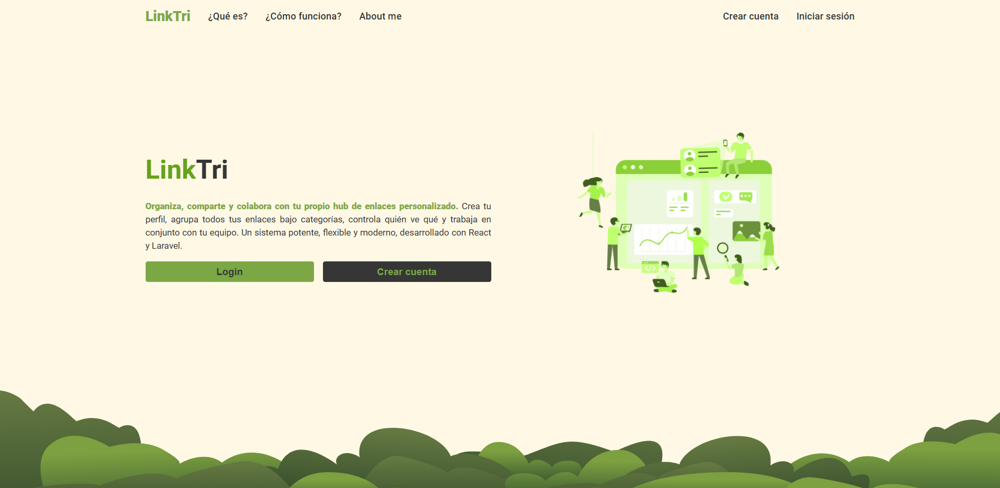
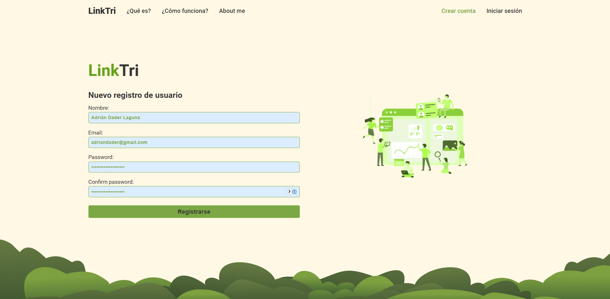
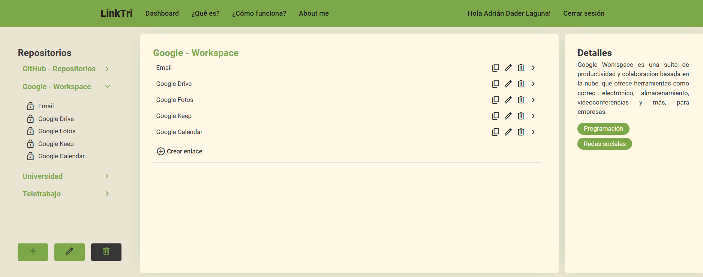

# Guía de usurio de Linktri

## 1. Landing Page

Al acceder por primera vez a **Linktri**, verás una guía sencilla sobre cómo utilizar la aplicación.  
Este espacio introductorio te explica de forma clara el funcionamiento básico de la plataforma.

- **Temática de los repositorios**: Puedes crear repositorios sobre una gran variedad de temas.
- **Etiquetas**: La aplicación permite una clasificación precisa gracias a un amplio sistema de etiquetas que puedes asignar libremente.

---

## 2. Registro / Inicio de sesión

En la sección de **Register / Login**, puedes crear tu cuenta de usuario con una contraseña segura.

- Una vez creada la cuenta, el sistema te inicia sesión automáticamente.
- Serás redirigido directamente al **Dashboard**.

---

## 3. Dashboard

El **Dashboard** es el centro de operaciones donde gestionarás tus repositorios y enlaces.

### Características principales:

- Al ingresar por primera vez, solo estará activo el botón ➕ **"Crear Repositorio"**.
- Para crear un repositorio, debes asignar **al menos una etiqueta**.
- Una vez creado el primer repositorio, se habilita la opción para **crear enlaces** en el espacio central de la interfaz.
- Los enlaces deben contener **una URL válida**.
- En la parte **derecha** del Dashboard se encuentra el **panel de detalles**, donde puedes ver y editar la información del repositorio o enlace seleccionado.
- Si necesitas borrar un repositorio entero, puedes hacer sin problema. Todos los enlaces al que pertenecen, serán eliminados de la base de datos.

---

¡Listo! Ya puedes comenzar a gestionar tus repositorios temáticos y compartir tus enlaces de forma organizada con **Linktri**.
